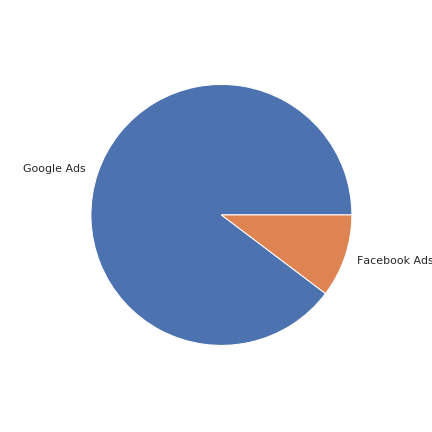
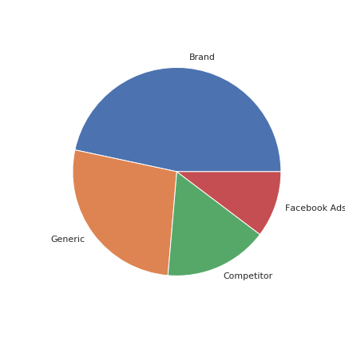
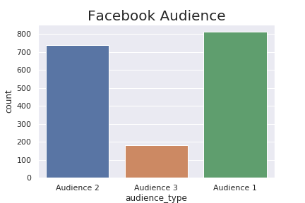
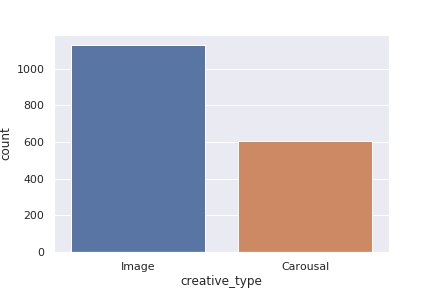
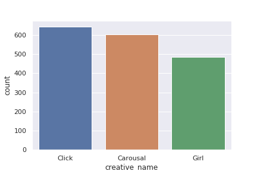
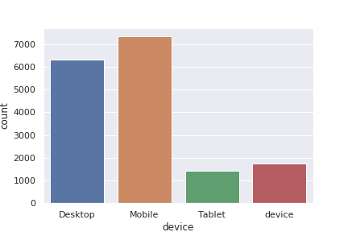
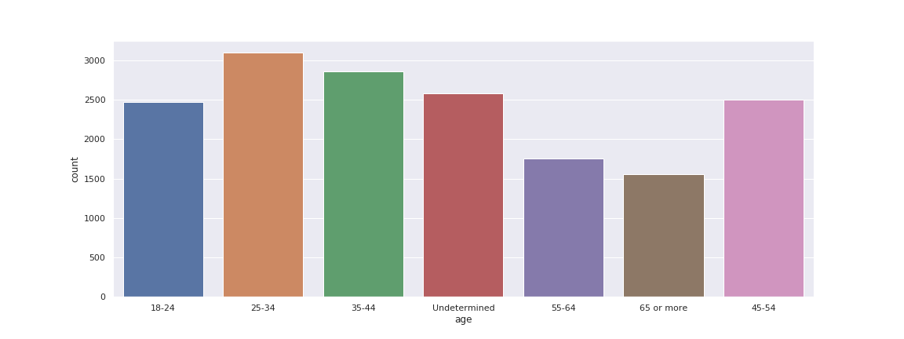
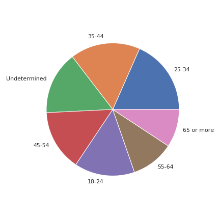

# Data Insights Summary

## Table of Contents

- [Introduction](#introduction)
- [Analysis](#analysis)
- [Great Insights](#great-insights)
- [Tableau Report](#tableau-report)
- [Conclusion](#conclusion)

### Introduction
The data is about digital marketing campaign of a single product on its performance phase.
The data is collected from two major online advertising platform Google and Facebook.
The main goal is to find the major age groups reacting to these Ads.

### Analysis

The Datatype of all the columns as follows:
```
Date                    datetime64[ns]
product                         object
phase                           object
campaign_platform               object
campaign_type                   object
communication_medium            object
subchannel                      object
audience_type                   object
creative_type                   object
creative_name                   object
device                          object
age                             object
spends                         float64
impressions                      int64
clicks                           int64
link_clicks                    float64
```

1. Only the `link_clicks` column is containing null values and the number of null values is 546.

2. After sorting the data based on the `Date` column, I have found that the data is collected from 16th October, 2019 to 7th July, 2019.

3. There are 257 unique date present in the data, where various people on various devices have seen the Ads.

4. The complete marketing campaign data revolving around a **single product** and also specifically in its **Performance** phase. So, I have removed those two columns.

5. There are two campaign platform where the marketing was done.
    - Google Ads
    - Facebook Ads
    
    
    
6. Out of 16,834 records, 15,101 records are from Google Ads and only 1,733 records are from facebook Ads. 
The product is getting more attraction from Google Ads which is 9 times more than Facebook Ads. 
    - Percentage of Attraction from Google Ads : 89.71%
    - Percentage of Attraction from Facebook Ads : 10.29%

7. The `campaign_type` for Google Ads is `Search` and the `campaign_type` for Facebook Ads is `Conversions`.
So, I have dropped the `campaign_type` column from the data due to 100% similarity to `campaign_platform`.

8. The `medium_communication` for Google Ads is `Search Keywords` and the `medium_communication` for Facebook Ads is `Creative`.
So, I have dropped the `medium_communication` column from the data due to 100% similarity to `campaign_platform`.

9. The `subchannel` column is specific to the Google Ads platform. The contribution of different subchannels of Google Ads are as follows:
    - Google Ads - Subchannel - Brand      ==> 52.00%
    - Google Ads - Subchannel - Generic    ==> 30.09%
    - Google Ads - Subchannel - Competitor ==> 17.91%
    
    

10. The `audience_type` column is specific to the Facebook Ads platform. There are three kinds of Audience Type related to the Facebook Ads.
    ```
    Audience 1      813 / 1733
    Audience 2      738 / 1733
    Audience 3      182 / 1733
    ```
    
    

11. The `creative_type` column is specific to the Facebook Ads platform. There are 2 creative types for facebook ads:
	```
	Image       1130 / 1733
	Carousal     603 / 1733
    ```
    - Facebook Ads - Creative Type - Image    : 65.20%
    - Facebook Ads - Creative Type - Carousal : 34.80%
    
    

12. The `creative_name` column is also specific to the Facebook Ads platform. The different creatives of Facebook Ads are:
	```
	Click           644 / 1733
	Carousal        603 / 1733
	Girl            486 / 1733
    ```

    - Facebook Ads - Creative Type - Image - Click    : 37.16%
    - Facebook Ads - Creative Type - Image - Girl     : 28.04%
    - Facebook Ads - Creative Type - Carousal         : 34.80%
    
    

13. The `device` column mostly related Google Ads. There is no appropriate data on Facebook Ads.
    ```
    Mobile     7357
    Desktop    6318
    device     1733
    Tablet     1426
    ```
    
    - Google Ads - device - Mobile    : 48.72%
    - Google Ads - device - Desktop   : 41.84%
    - Google Ads - device - Tablet    :  9.44%
    
    

14. From `age` column, more or less all the age groups are contributing same.
    ```
    18-24           14.684567
    25-34           18.397291
    35-44           17.019128
    45-54           14.844957
    55-64           10.437210
    65 or more       9.255079
    Undetermined    15.361768
    ```
    <div align="center">
    
    
    <br><br>
    
    
    </div>
    
15. From `spends` column, the Maximum Time spent on the website is 9221.96 seconds (153 mins or 2.5 hrs). Most of the people spent less than 2 minutes (More than 50%)


### Great Insights

- The product is getting more attraction from Google Ads campaign Platform.
- The product is getting more attraction from people of age group 25 - 44 (approximately 35%)
- And If targeted on the people of age group 18 - 50 (approximately 60%)
- In Facebook Ads, Image(Click type) is better than carousal.
- In Google Ads, concentrate more on *Brand* sub channel.
- Focus more on Mobile users, then Desktop users.
- The people wo spent more time are of age group 25 - 34.

### Tableau Report

Here is my report. Please click here to see my report.

Tableau Report - [Marketing Campaign](https://public.tableau.com/views/MarketingCampaign-MerkleSokratiDataScienceIntern/Dashboard1?:language=en-GB&:display_count=y&:origin=viz_share_link)

<a href="https://public.tableau.com/views/MarketingCampaign-MerkleSokratiDataScienceIntern/Dashboard1?:language=en-GB&:display_count=y&:origin=viz_share_link">

<div class='tableauPlaceholder' id='viz1598078639177' style='position: relative'><noscript><a href='#'></a></noscript><object class='tableauViz'  style='display:none;'><param name='host_url' value='https%3A%2F%2Fpublic.tableau.com%2F' /> <param name='embed_code_version' value='3' /> <param name='site_root' value='' /><param name='name' value='MarketingCampaign-MerkleSokratiDataScienceIntern&#47;Dashboard1' /><param name='tabs' value='no' /><param name='toolbar' value='yes' /><param name='static_image' value='https:&#47;&#47;public.tableau.com&#47;static&#47;images&#47;Ma&#47;MarketingCampaign-MerkleSokratiDataScienceIntern&#47;Dashboard1&#47;1.png' /> <param name='animate_transition' value='yes' /><param name='display_static_image' value='yes' /><param name='display_spinner' value='yes' /><param name='display_overlay' value='yes' /><param name='display_count' value='yes' /><param name='language' value='en-GB' /></object></div>

</a>


### Conclusion

Great Analysis will results in great results. Here, I have done my analysis, which makes more easy to build great ML models.


<br><br><br> <h3>Thank you</h3>
